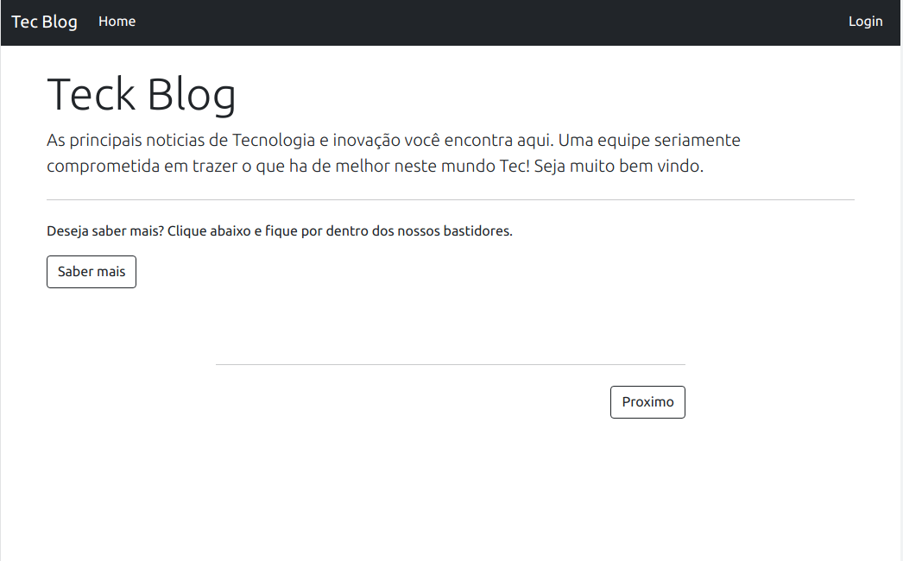

## Blog com painel Administrativo em Node.JS 🚀

Olá seja bem vindo ao repositório do projeto Blog.

Este projeto consiste em uma aplicação na arquitetura MVC utilizando NodeJs, e com banco de dados
Mysql. Neste Blog e possivel fazer cadastro de novos usuários, com o cadastro feito e possivel criar,
editar e deletar artigos, categorias e usuários. A finalidade deste projeto foi fazer um sistema onde 
usuários cadastrados tenham as mesmas permiçoes de fazer qualquer coisa. Na parte de criação de artigos
utilizei o [TinyMCE](https://www.tiny.cloud/) para ter um editor de texto completo. Siga no readme e
conheça melhor o projeto, foi bem desafiador e no final de tudo eu percebi o quanto aprendi e me
desenvoli com esta experiência.

## Estrutura

Abaixo demonstro a pagina inicial do Blog sem nenhum Artigo cadastrado.

`MVC` - MODEL, VIEWS e CONTROLLERS

1. MODEL: É responsável por toda interface com banco de dados, query's, conexão etc. No caso deste projeto 
sequelize e o responsável.
2. VIEWS: Se encontram todos os arquivos .HTML que renderizam as paginas e interface gráfica do sistema.
neste caso os arquivos são .ejs view engine utilizada.
3. CONTROLLERS: É responsável em ligar o model com as views, fazendo o meio de campo da arquitetura.
4. PUBLIC: Contém as imagens utilizadas no projeto, arquivos estáticos CSS e javaSript.
5. ROUTERS:  Possui as rotas da aplicação, sistema de rotas próprio do framework Express.
6. CONFIG: Possui as configurações de conexão do sequelize.
7. MIGRATIONS / SEEDERS: Pastas do sequelize, para a estrutura do banco de dados.

## tecnologias utilizadas

- Linguagens:
  - NodeJs
- Framework's:
  - Express
- Banco de dados:
  - Mysql
- ORM:
  - Sequelize
- Configurações
  - Dotenv
- View engine:
  - EJS
- Estilos:
  - Bootstrap
- Facilitador de desenvolvimento:
  - nodemon
- Organização e Padronização de codigo:
  - Eslint / config-airbnb-base

  ## Avisos

- Este projeto necessita do NodeJs instalado em seu computador e o banco de dados Mysql 
para rodar localmente.

- As demais dependêcias são instaladas com o comando npm install.

- Crie um arquivo .env na raiz da pasta SRC com as seguintes variáveis de ambiente:
  - MYSQL_PASSWORD= 'Sua senha do mysql se houver'
  - MYSQL_USER= 'User mysql normalmente ROOT'
  - HOSTNAME=localhost

## Executando

Verifique o package.json, la se encontram scripts para execução do projeto.

- `"debug": "nodemon index.js", (npm run debug) inicia o projeto com nodemon.`
- `"start": "node index.js", (npm start) inicia o projeto com node.`

## Funcionalidades principais

Abaixo estou ilustrando a página inicial da aplicação:

Em seguida demostro o fluxo completo da aplicação, cadastrando uma pergunta e respondendo.

